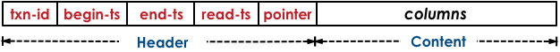

Peloton implements multi-version timestamp ordering (MVTO) protocol to serialize transactions. In this article, we describe in detail the implementation of this protocol in Peloton.

Peloton assigns each transaction `T` a
unique, monotonically increasing timestamp as its identifier (`T_id`)
when they first enter the system. 
MVTO protocol use this identifier to pre-compute transactions' commit order. 
In Peloton,
each physical version contains
five meta-data fields in its header for coordinating
the execution of concurrent transactions, as shown in the figure below.

The `txn-id` field is the version's write lock. Every tuple has
this field set to zero when Peloton creates it. If a transaction
`T` with identifier `T_id` wants to update a tuple `A`, then Peloton
checks whether `A`'s `txn-id` field is zero. If it is, then Peloton will
set the value of `txn-id` to `T_id` using an atomic compare-and-swap
(CaS) instruction. Any transaction that attempts to read `A`
is aborted if this `txn-id` field is neither zero or not equal to its `T_id`.
The next two meta-data fields are the `begin-ts` and `end-ts`
timestamps that represent the lifetime of the tuple version. Both
fields are initially set to zero. Peloton sets a tuple's `begin-ts` to
`INF` when the transaction deletes it.
The next field is a `read-ts` field which contain the identifier `txn-id` of the last transaction that read it. The last meta-data field is the
64-bit pointer that stores the address of the neighboring (previous
or next) version (if any) of a particular version.
A transaction that attempts to read or update a version
whose write lock is held by another transaction is aborted.
When transaction `T` invokes a read operation on logical tuple `A`,
Peloton searches for a physical version where `T_id` is in between
the range of the `begin-ts` and `end-ts` fields.
`T` is allowed to read version `A_x` if its write lock is not held by another 
active transaction (i.e., value of `txn-id` is zero or equal to `T_id`)
because MVTO never allows a transaction to read uncommitted
versions. Upon reading `A_x`, Peloton sets `A_x`'s `read-ts` field to `T_id`
if its current value is less than `T_id`. Otherwise, the transaction reads
an older version without updating this field.
With MVTO, a transaction always updates the latest version of
a tuple. Transaction `T` creates a new version `B_x+1` if (1) no active
transaction holds `B_x`'s write lock and (2) `T_id` is larger than `B_x`'s
`read-ts` field. If these conditions are satisfied, then Peloton
creates a new version `B_x+1` and sets its `txn-id` to `T_id`. When `T`
commits, Peloton sets `B_x+1`'s `begin-ts` and `end-ts` fields to `T_id`
and `INF` (respectively), and `B_x`'s `end-ts` field to `T_id`.

