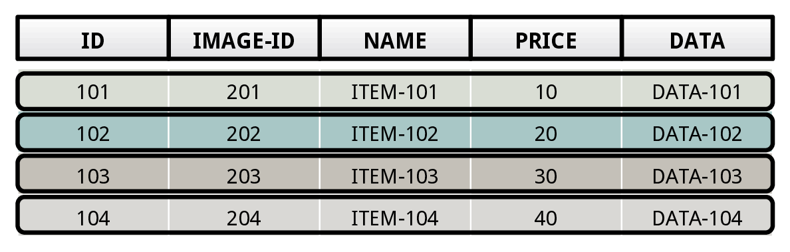
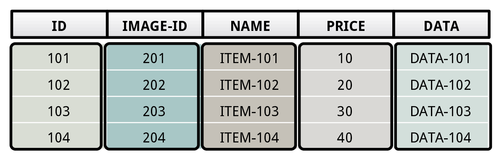
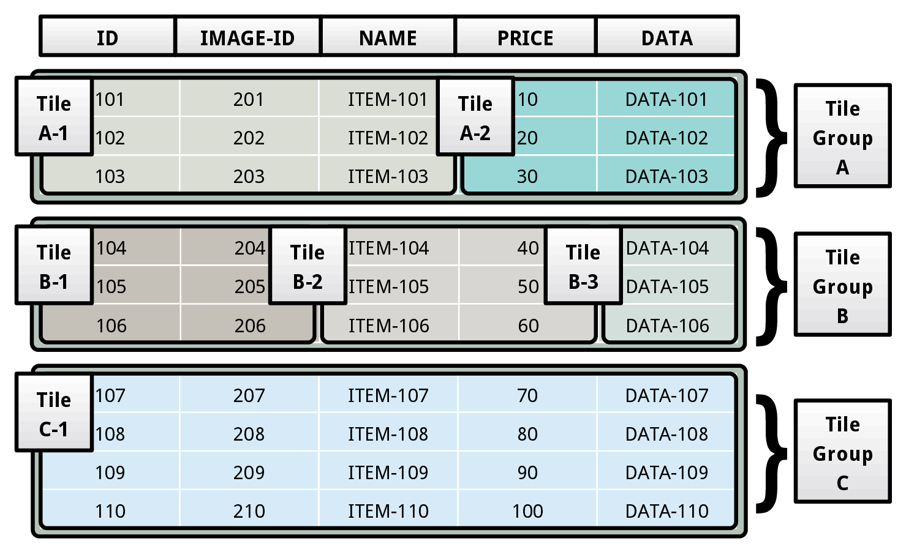
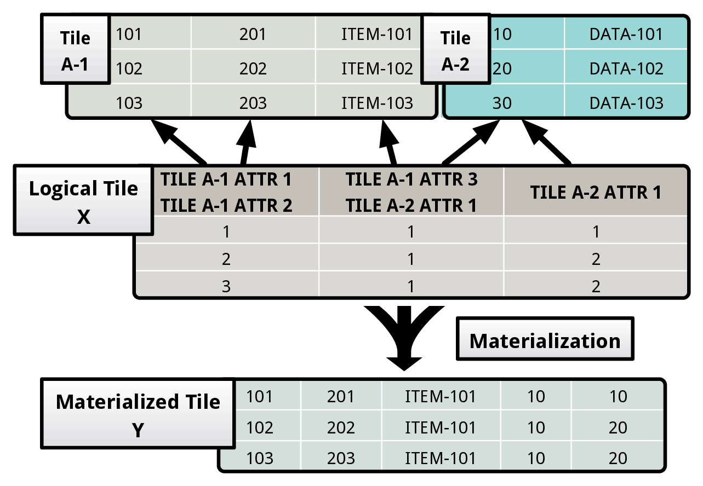
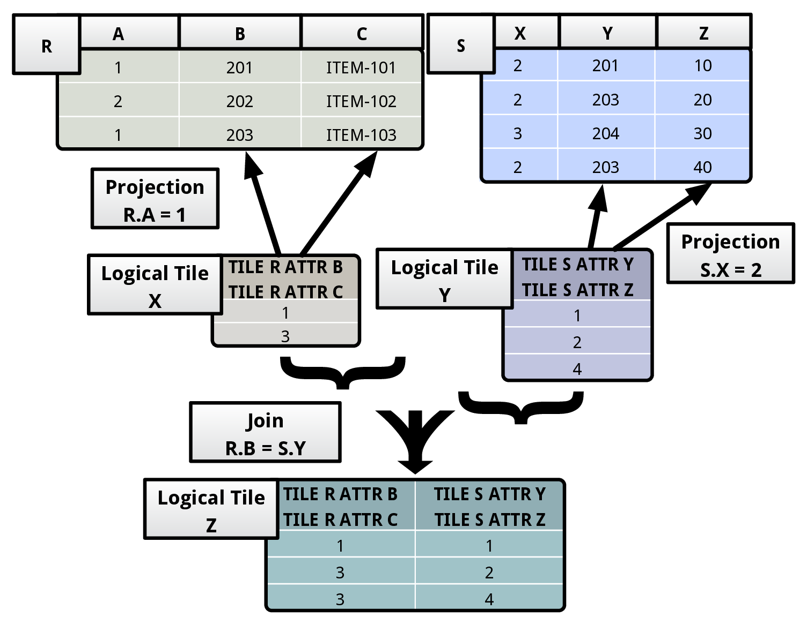

We now provide the motivation for and a detailed description of the tile based architecture of Peloton.

## N-ary Storage Model (NSM)

There are essentially two ways that DBMSs store data: (1) the n-ary storage model and (2) decomposition storage model. These models prescribe whether the DBMS stores the data in a tuple-centric or in an attribute-centric manner.

`N-ary storage model` (NSM) works well for OLTP workloads because the queries in transactions tend to operate only on an individual entity in the database at a time (e.g., a single customer record), and thus they need to access most (if not all) of the attributes for that entity. It is also ideal for insert-heavy workloads, because the DBMS can add tuples to the table using a single write. 

But, it is not a good choice for analytical queries in OLAP workloads. This is because these queries tend to access multiple entities in a table at the same time. These queries also typically only access a subset of the attributes for each entity. For example, a query might only analyze the location attribute for all of the customer records within a particular geographic region. But NSM-based DBMSs can only read tables tuple-at-a-time, and therefore they process the data in a tuple-centric manner within their query operators.

## Decomposition Storage Model (DSM)

An alternate approach, known as the `decomposition storage model` (DSM), stores data attribute-at-a-time. DSM works well for OLAP workloads because the DBMS only retrieves the values belonging to those attributes that are needed by the query. They also process the data attribute-at-a-time, thereby improving the CPU efficiency due to lower interpretation overhead and skipping unnecessary attributes. 

But just like how NSM systems are inefficient for read-only OLAP workloads, DSM systems are not ideal for write-heavy OLTP workloads. This is because these workloads are comprised of queries that insert and update tuples into the table. Unlike in NSM, this is an expensive operation in DSM, as the storage manager needs to copy over the tuples’ attributes to separate locations on the storage device.

## Flexible Storage Model (FSM)

Hence, the NSM and DSM architectures pose a problem for a DBMS supporting Hybrid Transactional/Analytical Processing (HTAP) workloads that include transactions that update the state of the database while also executing complex analytical queries on this data. We contend that it is better for the DBMS to use a flexible storage model that provides the benefits of both the NSM and DSM for their respective workloads, while avoiding the problems that they encounter with the other workloads.

This flexible storage model (FSM) is based on tile-oriented architecture. A tile is akin to a vertical/horizontal segment of table. We begin with a description of a storage architecture based on `physical tiles`. We then describe how to hide the layout of these physical tiles from the DBMS’s query processing components through `logical tiles`.

## Physical Tile

The fundamental physical storage unit of the DBMS is a tile tuple. Informally, a tile tuple is a subset of attribute values that belong to a tuple. A set of tile tuples form a **physical tile**. We refer to a collection of physical tiles as a **tile group**. The storage manager physically stores a table as a set of tile groups. All the physical tiles belonging to a tile group contain the same number of tile tuples. Under this model, the DBMS’s type system consists of a set of primitive data types, and the only aggregate data type it supports is the tile tuple type, which is a collection of primitive types.

Consider the table layout shown above. The table comprises of three tile groups (A, B, C), that each contain a disparate number of physical tiles. The tile group A consists of two tiles (A-1, A-2). The tile A-1 contains the first three attributes (ID, IMAGE-ID, NAME) of the table, while the tile A-2 contains the remaining two attributes (PRICE, DATA). These two tiles form the tile group A.

**SOURCE CODE**: [Physical tile](https://github.com/cmu-db/peloton/blob/master/src/storage/tile.cpp) and [tile group](https://github.com/cmu-db/peloton/blob/master/src/storage/tile_group.cpp).

## Logical Tile

An architecture based on physical tiles enables the DBMS to organize data in any possible layout that works well for the HTAP workload. The problem with storing data in different layouts, however, is that it is difficult to efficiently execute queries over this data.

To overcome this problem, we propose an abstraction layer in our architecture based on logical tiles. A logical tile succinctly represents values spread across a collection of physical tiles from one or more tables. The DBMS uses this abstraction to hide the specifics of the layout of the table from its execution engine, without sacrificing the performance benefits of a workload-optimized storage layout. We now illustrate the abstraction with an example.

In the example shown above, the logical tile X points to data in the two physical tiles A-1 and A-2. Each column of a logical tile contains a list of offsets corresponding to the tuples in the underlying physical tiles. A column in a logical tile can represent the data stored in one or more attributes spread across a collection of physical tiles. The DBMS stores this mapping in the logical tile’s metadata region. It records this information only once for a logical tile’s column. For instance, the first column in X maps to the first and second attributes of A-1. When the DBMS materializes X, it uses the first column to construct the first two attributes of the materialized tile Y.

The value stored in the first column of the first row of X represents the values present in the first two attributes of the first tuple of A-1. During materialization, the DBMS transforms it into {101, 201}. Similarly, the value stored in the the second column of the first row of X maps to the third attribute of A-1 and the first attribute of A-2. On materialization, it becomes {ITEM-101, 10}.

For all the attributes that a column in a logical tile maps to, the DBMS uses the same list of tuple offsets during materialization. It is possible for two columns in a logical tile (with unique offset lists) to map to the same attribute in a physical tile. This is exemplified by the second and the third columns of X. To simplify the abstraction, we restrict logical tiles from referring to other logical tiles, meaning that every logical tile column maps to an attribute in a physical tile.

**SOURCE CODE**: [Logical tile](https://github.com/cmu-db/peloton/blob/master/src/executor/logical_tile.cpp).

## Join Operator in Logical Tile Algebra

The join operator takes in a pair of logical tiles X and Y , and then evaluates the join predicate P(x,y) over them. It constructs an output logical tile by concatenating the schemas of X and Y . Then, while going over every pair of tuples, if it finds a pair satisfying the predicate P , it concatenates them and appends them to the output logical tile. In the figure shown below, we note that the output logical tile Z is obtained by concatenating the matching tuple pairs from the input logical tiles X and Y.

**SOURCE CODE**: [Nested Loop Join Executor](https://github.com/cmu-db/peloton/blob/master/src/executor/nested_loop_join_executor.cpp).